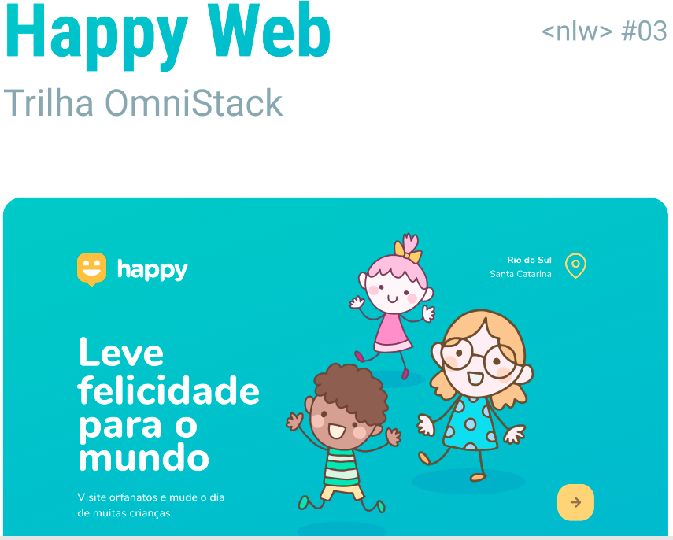

  

#### :wrench: em contrução :hammer:

## :notebook_with_decorative_cover: Conteúdo
**Happy** é um software baseado em Web com o objetivo de conectar pessoas às instituições orfanatos.

### :sparkles: Funcionalidades

### :computer: Tecnologias aplicadas
- CSS3 
- HTML5
- JavaScript 
- Node
- React
- SQL
- Typescript

### :rocket: Sobre
Projeto proposto pela **RocketSeat** no evento ***Next Level Week 3***, durante os dias 12 a 18 de outubro de  2020.  
*official website*: https://rocketseat.com.br/

#### :memo: Licença
Esse projeto está sob a licença MIT. Veja o arquivo [LICENSE](LICENSE) para mais detalhes.

